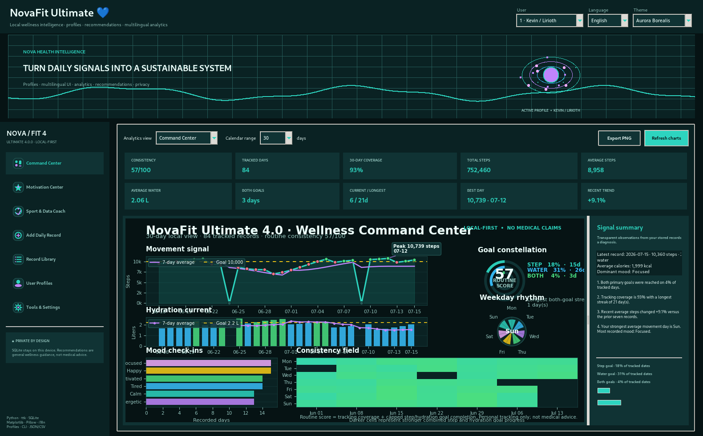
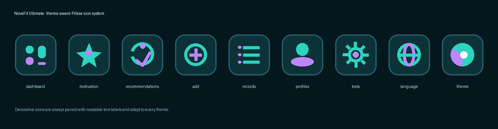
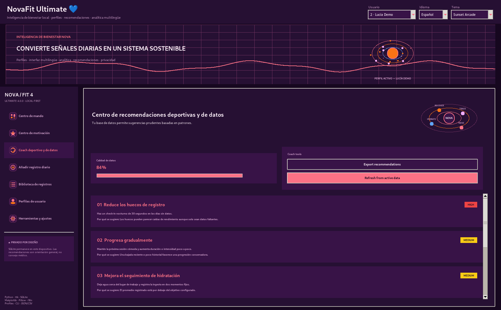
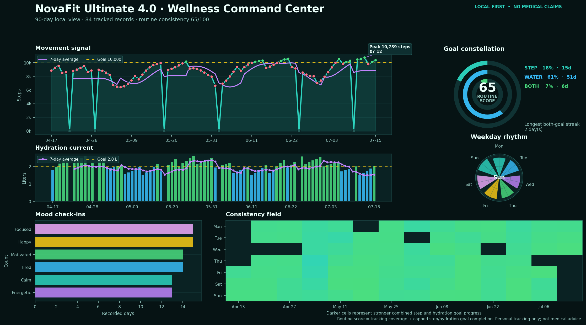
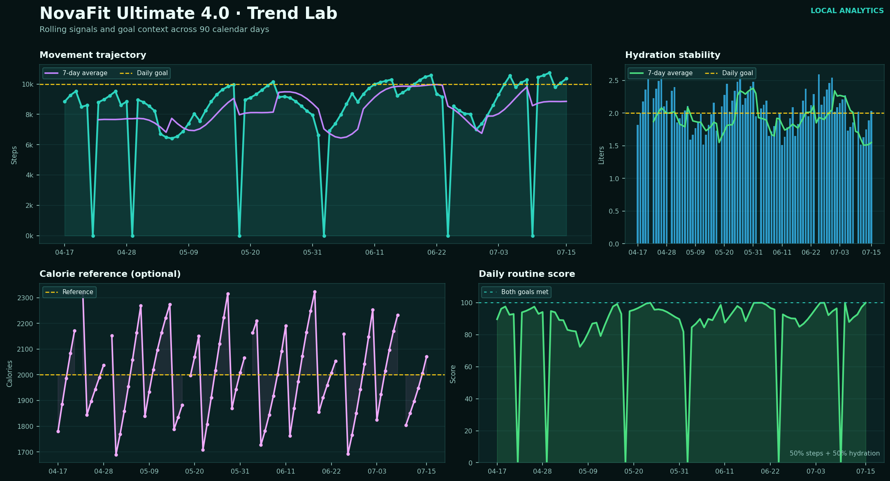
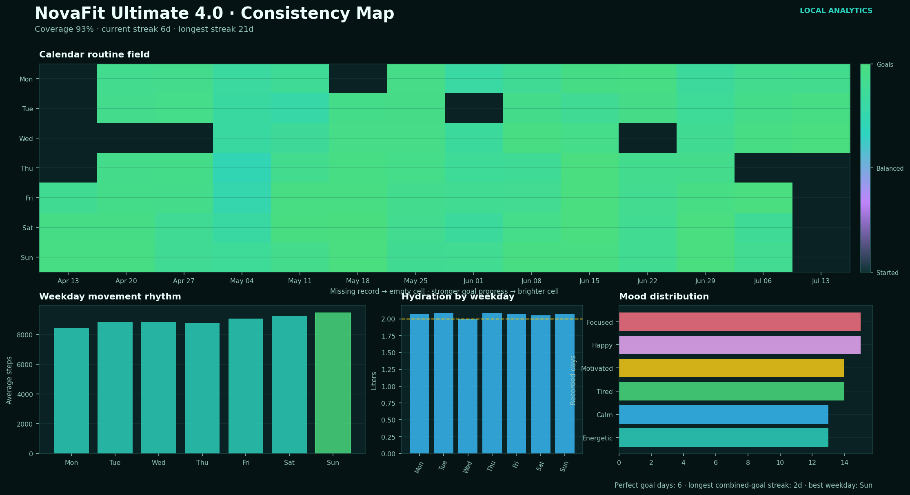
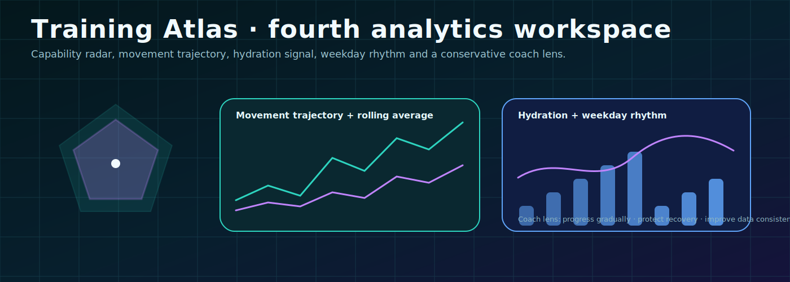
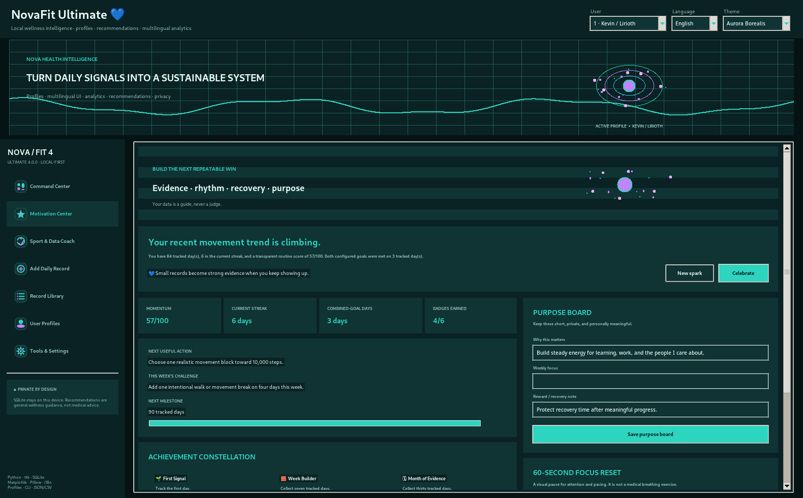
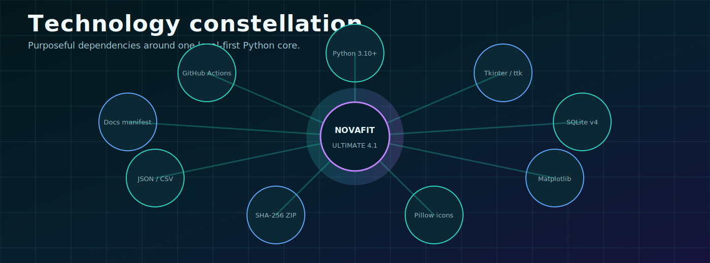
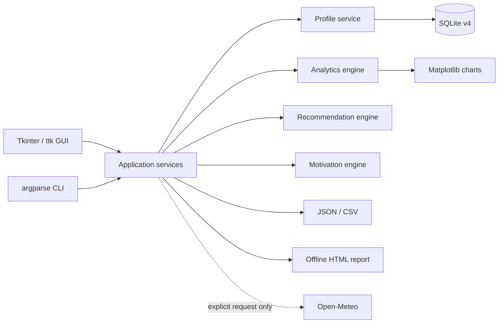

<div align="center">

<picture>
  <source media="(prefers-reduced-motion: reduce)" srcset="./assets/novafit-ultimate-gui.png" />
  
</picture>

# NovaFit Ultimate 4.0 💙

### Local-first wellness intelligence · multi-user profiles · EN/ES/HE · 12 themes · explainable recommendations · ambitious analytics

[](https://www.python.org/)
[](#-desktop-experience)
[](#-multi-user-data-model)
[](#-quality-and-verification)
[](#-three-language-interface)
[](#-privacy-and-safety-boundaries)

**Turn daily signals into a sustainable, understandable system — without sending personal wellness records to a server.**

[English](README.md) · [Español](README_ES.md) · [עברית](README_HE.md)

[Quickstart](#-windows-quickstart) · [GUI](#-desktop-experience) · [CLI](#-expanded-cli) · [Architecture](#-architecture) · [Testing](#-quality-and-verification) · [Docs](#-documentation-map)

</div>

---

## 🌌 Product vision

NovaFit is a private desktop and terminal application for recording daily steps, water, optional calories, mood and notes. Version **4.0.0** evolves the restored health tracker into a portfolio-grade **Wellness Intelligence Studio** with:

- multiple isolated local user profiles;
- English, Spanish and Hebrew interface switching;
- true RTL shell behavior for Hebrew;
- twelve visual themes;
- four high-density analytical workspaces;
- grounded Motivation and Recovery tools;
- conservative Sport & Data recommendations;
- theme-aware Pillow icons;
- a colorful Tkinter/ttk GUI;
- an expanded automation-friendly CLI;
- SQLite migrations from the historical single-user schema;
- JSON and CSV portability;
- offline visual HTML reports;
- optional weather lookup with no API key;
- self-healing Windows setup and verification;
- workspace-safe auditing and clean release staging.

> NovaFit is a descriptive tracking and motivation tool. It does not diagnose, prescribe treatment or replace qualified medical or sports guidance.

---

## ✅ What changed after the reported checker failure

The application tests, smoke checks and profile generation had all passed. The final package audit failed only because it found `NovaFit/data/novafit.db` — a legitimate runtime database created by actual use of the program.

Version 4.0 separates two contexts deliberately:

| Context | Database behavior | Audit behavior |
|---|---|---|
| **User workspace** | `data/novafit.db` is expected and preserved | Verifies code, tests and links without deleting or rejecting personal data |
| **Release staging** | Runtime database, logs and local config are excluded | Runs `--strict-distribution` and rejects unsafe distributable files |


This is protected by automated regression tests. The checker no longer asks users to delete their own data to prove that the source package is safe.

---

## 🖥️ Desktop experience

The real Tkinter interface uses a large animated hero, persistent navigation, theme-aware vector-like icons, an active-user selector, a language selector and a twelve-theme selector.



### Main workspaces

| Workspace | Purpose |
|---|---|
| **Command Center** | Executive metrics, chart selection, calendar range and grounded signal summary |
| **Motivation Center** | Daily spark, purpose board, achievements, next useful action and recovery pacing |
| **Sport & Data Coach** | Explainable movement, hydration, recovery and data-quality suggestions |
| **Add Daily Record** | Validated record entry for the active profile |
| **Record Library** | Search, inspect, edit and delete profile-scoped history |
| **User Profiles** | Create, activate, update and remove isolated local profiles |
| **Tools & Settings** | Backups, imports, weather, theme, language, goals, UI scale and reports |

<picture>
  <source media="(prefers-reduced-motion: reduce)" srcset="./assets/novafit-ultimate-gui.png" />
  
</picture>

### Theme-aware icons

NovaFit draws its navigation icons with Pillow rather than depending on platform-specific emoji rendering or a third-party icon font. Each decorative icon is paired with a readable text label.



---

## 👥 Multi-user profiles

Each user profile owns a separate view of daily records and preferences:

- display name and avatar;
- interface language;
- visual theme;
- step, water and calorie-reference goals;
- activity level;
- preferred sport focus;
- isolated records using `UNIQUE(user_id, date)`.


The primary profile is protected from deletion. Other profiles may be removed only after confirmation, and their records are deleted through SQLite foreign-key cascading.

---

## 🌍 Three-language interface

NovaFit supports:

| Language | Code | Direction | Product behavior |
|---|---:|---:|---|
| English | `en` | LTR | Default technical interface |
| Español | `es` | LTR | Spanish navigation, forms, preferences and recommendations |
| עברית | `he` | RTL | Sidebar moves right, key controls mirror and copy uses Hebrew |




Language, theme and goals belong to the active profile. Switching profiles also switches that user’s visual and language preferences.

---

## 🎨 Twelve themes

| Theme ID | Display name | Character |
|---|---|---|
| `midnight` | Midnight Neon | Deep cyber-night |
| `aurora` | Aurora Borealis | Teal, cyan and violet |
| `desert` | Negev Sunrise | Warm local desert palette |
| `ocean` | Ocean Depth | Blue and aqua focus |
| `forest` | Forest Focus | Calm greens |
| `rose` | Rose Quartz | Pink and violet |
| `cloud` | Cloud Day | Soft bright interface |
| `solar` | Solar Paper | Editorial cream and gold |
| `contrast` | High Contrast | Strong accessible separation |
| `sapphire` | Royal Sapphire | Deep blue professional mode |
| `lime` | Cyber Lime | High-energy green technology |
| `arcade` | Sunset Arcade | Coral, violet and retro light |


<picture>
  <source media="(prefers-reduced-motion: reduce)" srcset="./assets/theme-spectrum.png" />
  
</picture>

Decorative motion can be disabled from settings. Continuous Canvas animation stops when **Reduce decorative motion** is enabled.

---

## 📊 Four analytics workspaces

### 1. Wellness Command Center

- movement signal and seven-day average;
- hydration current;
- goal constellation;
- mood distribution;
- weekday rhythm;
- consistency field;
- transparent narrative summary.



### 2. Trend Lab

- long-term movement trajectory;
- rolling averages;
- hydration stability;
- routine-score history;
- missing-date visibility;
- recent-period comparison.



### 3. Consistency Map

- calendar heatmap;
- weekday performance;
- mood frequency;
- combined-goal streaks;
- perfect-goal days;
- coverage gaps.



### 4. Training Atlas

The new Ultimate workspace combines a capability radar with movement, hydration, weekday rhythm and a coach lens.




Available calendar ranges:

```text
7 · 14 · 30 · 60 · 90 · 180 · 365 days
```

---

## 🧠 Sport & Data Coach

The recommendation engine uses only the active user’s stored records, configured goals and profile preferences.


### Recommendation families

- gradual movement progression;
- hydration tracking consistency;
- recovery protection;
- data-quality improvement;
- weekly rhythm adapted to `beginner`, `balanced` or `active` profiles;
- context from walking, mobility, strength, running, cycling or mixed focus.

Every recommendation includes:

1. a priority;
2. one small action;
3. an explanation of why it appears;
4. a confidence level derived from tracking coverage;
5. a scope disclaimer.

The engine does **not** infer disease, injury, nutrition needs, training zones or medical risk.

---

## ✨ Motivation and Recovery Center

The Motivation Center uses deterministic local data rather than artificial personality claims.



It includes:

- daily motivation spark;
- current and longest streak;
- transparent routine score;
- milestone progress;
- earned achievements;
- a private purpose board;
- a suggested weekly focus;
- a gentle one-minute visual pacing reset;
- reduced-motion support.

The routine score is documented and descriptive:

```text
30% tracking coverage
25% step-goal consistency
25% water-goal consistency
20% recent seven-day continuity
```

It is not a medical score.

---

## ⌨️ Expanded CLI

The CLI is automation-friendly, colored when supported and readable when ANSI color is disabled.

### Help and version

```bash
python -m novafit.cli --help
python -m novafit.cli --version
```

### Interactive menu

```bash
python -m novafit.cli --menu
```

### Add a record

```bash
python -m novafit.cli \
  --user "Kevin / Lirioth" \
  --add 2026-07-15 \
  --steps 10420 \
  --water 2.4 \
  --calories 2050 \
  --mood Focused \
  --note "Evening walk in Beersheba"
```

### Profiles

```bash
python -m novafit.cli --profiles

python -m novafit.cli \
  --create-user "Lucía" \
  --language es \
  --theme arcade \
  --avatar sun \
  --activity-level beginner \
  --sport-focus walking
```

### Trilingual recommendations

```bash
python -m novafit.cli --user "Lucía" --recommendations --language es
python -m novafit.cli --user 3 --recommendations --language he
```

### Analytics export

```bash
python -m novafit.cli \
  --user 1 \
  --chart data/training-atlas.png \
  --chart-view training_atlas \
  --chart-days 90 \
  --chart-theme sapphire
```

### Portable report

```bash
python -m novafit.cli \
  --report-html data/reports/novafit-report.html \
  --chart-view command_center \
  --chart-days 30 \
  --chart-theme aurora
```

### Other actions

```bash
python -m novafit.cli --sample
python -m novafit.cli --seed 90
python -m novafit.cli --dashboard
python -m novafit.cli --motivation
python -m novafit.cli --list 20
python -m novafit.cli --weather "Be'er Sheva"
python -m novafit.cli --export-json data/backup.json
python -m novafit.cli --export-csv data/backup.csv
```

---

## 🪟 Windows quickstart

### Recommended clean installation

1. Extract the ZIP to a short path such as:

```text
C:\NovaFit-Ultimate
```

2. Run:

```text
REPAIR_AND_VERIFY.bat
```

3. After verification, run:

```text
run_novafit.bat
```

The repair flow:

```text
Detect Python 3.10–3.14
        ↓
Create or repair .venv
        ↓
Install binary dependencies
        ↓
Validate Tkinter + Matplotlib + Pillow + tzdata
        ↓
Run 74 automated tests
        ↓
Run isolated CLI/SQLite/PNG/HTML smoke workflow
```

### Useful launchers

| Launcher | Purpose |
|---|---|
| `setup_windows.bat` | Build environment and verify |
| `REPAIR_AND_VERIFY.bat` | Repair an incomplete environment and run checks |
| `run_novafit.bat` | Open the GUI, preparing the environment if needed |
| `run_cli.bat` | Open the expanded terminal menu |
| `verify_windows.bat` | Re-run project tests and smoke checks |
| `export_backup.bat` | Export JSON and CSV |
| `export_report.bat` | Generate an offline HTML report |
| `export_analytics_gallery.bat` | Generate analytics images |
| `open_data_folder.bat` | Open the local data directory |

See [docs/WINDOWS_GUIDE.md](docs/WINDOWS_GUIDE.md) and [docs/DISTRIBUTION_SAFETY.md](docs/DISTRIBUTION_SAFETY.md).

---

## 🏗️ Architecture





### Key modules

| Module | Responsibility |
|---|---|
| `novafit/gui.py` | Desktop shell, navigation, selectors and workflows |
| `novafit/cli.py` | Command-line contract and interactive menu |
| `novafit/database.py` | Schema v4, migrations, profile-scoped CRUD |
| `novafit/models.py` | Validated `HealthEntry` and `UserProfile` models |
| `novafit/analytics.py` | Metrics, streaks, trends and transparent insights |
| `novafit/charts.py` | Four Matplotlib workspaces and PNG export |
| `novafit/recommendations.py` | Conservative explainable recommendation plan |
| `novafit/motivation.py` | Deterministic motivation and milestone logic |
| `novafit/i18n.py` | EN/ES/HE copy, language aliases and direction metadata |
| `novafit/themes.py` | Twelve coordinated GUI/chart themes |
| `novafit/icon_factory.py` | Theme-aware Pillow navigation icons |
| `novafit/io_utils.py` | JSON/CSV import, export and sample data |
| `novafit/reporting.py` | Self-contained offline HTML report |
| `scripts/verify.py` | Compile, test and isolated smoke workflow |

---

## 🗄️ Multi-user data model

```sql
CREATE TABLE profiles (
    id INTEGER PRIMARY KEY,
    display_name TEXT NOT NULL UNIQUE,
    avatar TEXT NOT NULL,
    language TEXT NOT NULL,
    theme TEXT NOT NULL,
    step_goal INTEGER NOT NULL,
    water_goal_l REAL NOT NULL,
    calorie_goal INTEGER NOT NULL,
    activity_level TEXT NOT NULL,
    sport_focus TEXT NOT NULL,
    created_at TEXT NOT NULL,
    updated_at TEXT NOT NULL
);

CREATE TABLE logs (
    id INTEGER PRIMARY KEY,
    user_id INTEGER NOT NULL,
    date TEXT NOT NULL,
    steps INTEGER NOT NULL,
    water_l REAL NOT NULL,
    calories INTEGER,
    mood TEXT,
    note TEXT,
    created_at TEXT NOT NULL,
    updated_at TEXT NOT NULL,
    UNIQUE(user_id, date),
    FOREIGN KEY(user_id) REFERENCES profiles(id) ON DELETE CASCADE
);
```

### Legacy migration

A historical `logs` table without `user_id` is migrated by:

1. renaming the old table;
2. creating schema v4;
3. creating the primary profile;
4. copying historical rows to profile `1`;
5. preserving notes and timestamps when present;
6. dropping the temporary legacy table only after successful copy.

See [docs/DATA_MODEL.md](docs/DATA_MODEL.md) and [docs/MULTI_PROFILE.md](docs/MULTI_PROFILE.md).

---

## 🔒 Privacy and safety boundaries

- wellness records remain in local SQLite;
- profile purpose notes remain local;
- exports happen only after an explicit user action;
- weather requests send only city coordinates, never wellness records;
- HTTPS verification is never globally disabled;
- SQL parameters are bound rather than interpolated;
- HTML notes are escaped in reports;
- sample data is deterministic or anonymized;
- release ZIPs exclude `.db`, logs, config and private exports;
- recommendations remain general and conservative;
- missing data is shown as uncertainty rather than silently invented.

The application is not designed for emergencies, diagnosis, medical monitoring, rehabilitation protocols or high-risk training decisions.

---

## 🧪 Quality and verification

### Latest measured result

```text
74 tests run
74 passed
0 failed
```

The test suite covers:

- input validation;
- profile-isolated SQLite CRUD;
- legacy single-user migration;
- primary-profile protection;
- English/Spanish/Hebrew normalization;
- Hebrew RTL direction metadata;
- all twelve theme palettes;
- analytics and missing-day handling;
- Training Atlas generation;
- recommendation confidence and scope boundaries;
- Motivation Center behavior;
- JSON/CSV round trips;
- HTML escaping;
- CLI profile and recommendation routes;
- environment repair contract;
- workspace-safe versus distribution-strict audit behavior;
- weather success and offline recovery.

### Run locally

```bash
python scripts/verify.py
```

or on Windows:

```text
REPAIR_AND_VERIFY.bat
```

> `74/74 passed` means every implemented automated case passed. It does not claim 100% line or branch coverage.

---

## 📦 Distribution safety

The integrated checker may run inside an active user workspace. It must therefore preserve `data/novafit.db`.

The release builder instead copies public source files to a temporary staging tree while excluding:

```text
.venv/
__pycache__/
*.pyc
*.db
*.sqlite*
.env
config.json
novafit.log
runtime exports
```

The staging tree is then audited with:

```bash
python tools/package_audit.py --strict-distribution
```

This directly fixes the contradiction that produced the previous final audit failure.

---

## 📁 Project structure

```text
NovaFit/
├── novafit/
│   ├── gui.py
│   ├── cli.py
│   ├── database.py
│   ├── models.py
│   ├── analytics.py
│   ├── charts.py
│   ├── recommendations.py
│   ├── recommendations_panel.py
│   ├── motivation.py
│   ├── motivation_panel.py
│   ├── profile_panel.py
│   ├── i18n.py
│   ├── themes.py
│   ├── icon_factory.py
│   ├── io_utils.py
│   ├── reporting.py
│   └── weather.py
├── tests/
├── scripts/
├── docs/
├── assets/
├── data/.gitkeep
├── pyproject.toml
├── requirements.txt
├── README.md
├── README_ES.md
├── README_HE.md
└── *.bat
```

---

## 📚 Documentation map

| Document | Purpose |
|---|---|
| [ULTIMATE_GUI.md](docs/ULTIMATE_GUI.md) | Desktop navigation, selectors, responsive behavior and screenshots |
| [MULTI_PROFILE.md](docs/MULTI_PROFILE.md) | Profile lifecycle, data isolation and migration |
| [I18N_RTL.md](docs/I18N_RTL.md) | Language architecture and Hebrew RTL behavior |
| [SPORT_DATA_RECOMMENDATIONS.md](docs/SPORT_DATA_RECOMMENDATIONS.md) | Recommendation rules, confidence and safety scope |
| [DISTRIBUTION_SAFETY.md](docs/DISTRIBUTION_SAFETY.md) | Checker repair, workspace mode and clean staging |
| [ANALYTICS.md](docs/ANALYTICS.md) | Metric formulas and chart semantics |
| [DATA_MODEL.md](docs/DATA_MODEL.md) | SQLite schema and migrations |
| [TESTING.md](docs/TESTING.md) | Automated suite and manual gates |
| [WINDOWS_GUIDE.md](docs/WINDOWS_GUIDE.md) | Setup, repair and launchers |
| [SECURITY.md](docs/SECURITY.md) | Privacy and technical boundaries |
| [CHANGELOG.md](docs/CHANGELOG.md) | Release history |

---

## 🛣️ Roadmap

### Completed in 4.0

- [x] Multi-user profile isolation
- [x] EN/ES/HE language selector
- [x] Hebrew RTL shell
- [x] Twelve themes
- [x] Theme-aware Pillow icons
- [x] Sport & Data Coach
- [x] Training Atlas
- [x] Workspace-safe audit
- [x] Strict clean release staging
- [x] Expanded profile-aware CLI
- [x] 74 passing automated tests

### Reasonable future work

- [ ] Optional encrypted backup format
- [ ] Calendar and wearable import adapters with explicit privacy review
- [ ] Accessibility audit on native Windows scaling modes
- [ ] More complete translation of chart annotations
- [ ] Optional plugin boundary for additional recommendation families
- [ ] Signed Windows installer after native release testing

---

## 👨‍💻 Author

**Kevin “Lirioth” Cusnir**  
Beersheba, Israel · Asia/Jerusalem  
[GitHub](https://github.com/LiriothTeltanion) · [LinkedIn](https://www.linkedin.com/in/kevin-cusnir-883173b4/)

---

## 📄 License

MIT License. See [LICENSE](LICENSE).

<div align="center">

**Build steadily. Read the data honestly. Protect recovery. Keep ownership of the system.** 💙

**NovaFit Ultimate 4.0 · Wellness Intelligence Studio · 2026-07-15**

</div>
