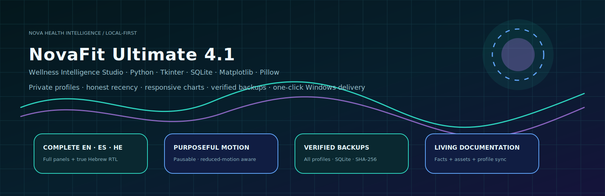
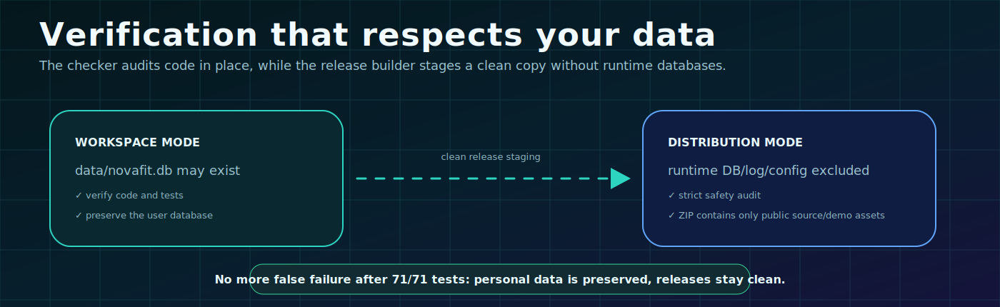
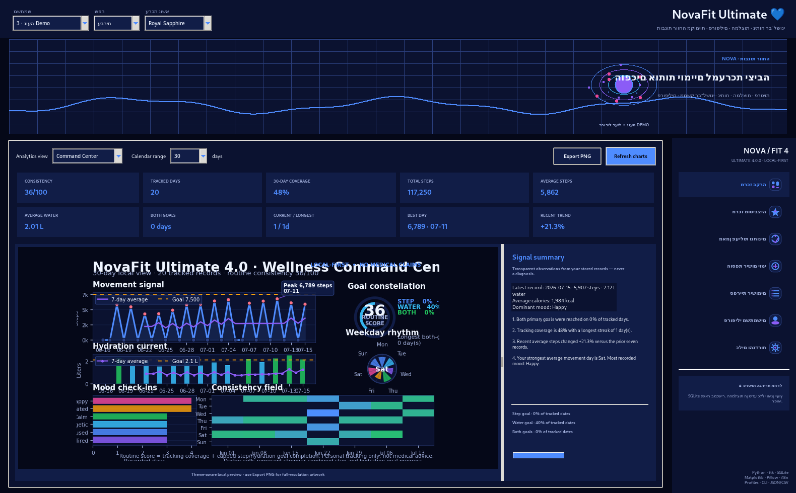
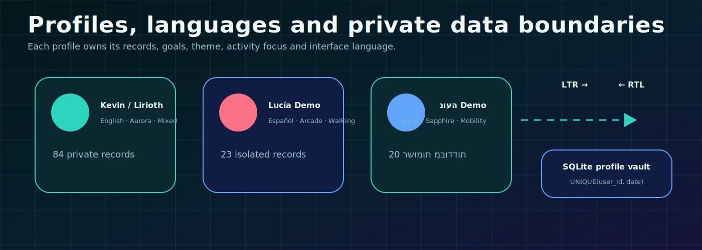
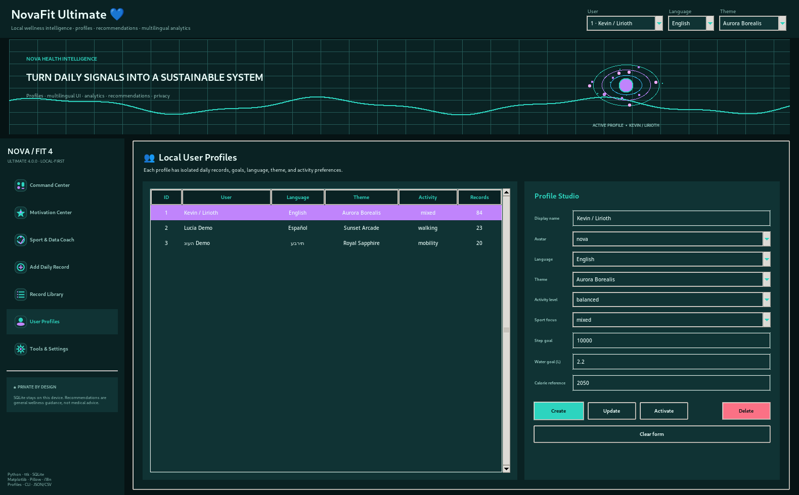
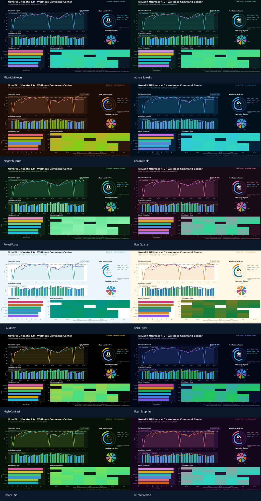
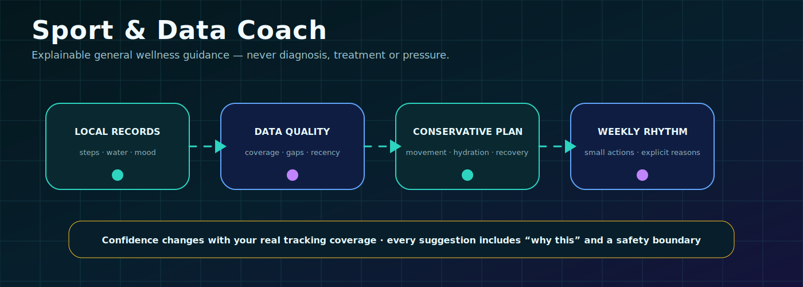

<div align="center" dir="rtl">

<picture>
  <source media="(prefers-reduced-motion: reduce)" srcset="./assets/hebrew-rtl-command-center.png" />
  
</picture>

# NovaFit Ultimate 4.0 💙

### מערכת מקומית לתיעוד, ניתוח ומוטיבציה · פרופילים מרובים · אנגלית/ספרדית/עברית · 12 ערכות נושא

[English](README.md) · [Español](README_ES.md) · [עברית](README_HE.md)

</div>

---

<div dir="rtl">

## 🌌 מהי NovaFit?

NovaFit היא אפליקציית שולחן עבודה ושורת פקודה מקומית. היא שומרת צעדים, מים, קלוריות אופציונליות, מצב רוח והערות פרטיות ב־SQLite במכשיר שלך.

גרסה 4.0 כוללת:

- פרופילי משתמשים מבודדים;
- מעבר בין אנגלית, ספרדית ועברית;
- ממשק RTL אמיתי בעברית;
- 12 ערכות נושא;
- ארבע תצוגות ניתוח;
- מרכז מוטיבציה והתאוששות;
- מאמן פעילות ונתונים;
- אייקונים מותאמי ערכת נושא;
- גיבויי JSON/CSV;
- דוחות HTML ללא שרת;
- CLI מורחב;
- תיקון סביבת Windows אוטומטי;
- בדיקה ששומרת על מסד הנתונים האישי.

> NovaFit מספקת מידע כללי ותיאורי בלבד. היא אינה ייעוץ רפואי, אבחון, טיפול או תוכנית אימון מקצועית.

---

## ✅ תיקון שגיאת האימות

הבדיקות עברו, אך הבודק הישן נכשל מפני שמצא את `data/novafit.db` — מסד נתונים לגיטימי שנוצר בעת שימוש באפליקציה.

כעת קיימים שני מצבים:

- **Workspace:** שומר את מסד הנתונים וממשיך לבדוק את הקוד.
- **Distribution:** יוצר עותק נקי ללא DB, לוגים או הגדרות אישיות.



---

## 🖥️ ממשק שולחן העבודה



במצב עברית:

- סרגל הניווט מופיע מימין;
- בקרי המשתמש, השפה וערכת הנושא עוברים לצד המתאים;
- הטקסט המרכזי מוצג בעברית;
- כל פרופיל שומר שפה וערכת נושא משלו.

---

## 👥 פרופילים מקומיים



לכל פרופיל יש:

- שם ואווטאר;
- שפה;
- ערכת נושא;
- יעדי צעדים, מים וקלוריות;
- רמת פעילות;
- תחום פעילות מועדף;
- רשומות מבודדות לפי `user_id` ותאריך.



---

## 🎨 שתים־עשרה ערכות נושא

Midnight Neon · Aurora Borealis · Negev Sunrise · Ocean Depth · Forest Focus · Rose Quartz · Cloud Day · Solar Paper · High Contrast · Royal Sapphire · Cyber Lime · Sunset Arcade.



---

## 📊 תצוגות ניתוח

1. Wellness Command Center
2. Trend Lab
3. Consistency Map
4. Training Atlas


התרשימים מציגים דפוסים מתועדים, ימים חסרים, ממוצעים, רצפים ועמידה ביעדים. הם אינם מציגים אבחון רפואי.

---

## 🧠 מאמן פעילות ונתונים



המאמן עשוי להציע:

- התקדמות הדרגתית;
- תיעוד מים עקבי;
- הגנה על התאוששות;
- שיפור איכות הנתונים;
- קצב שבועי בהתאם להעדפת הליכה, ניידות, כוח, ריצה, רכיבה או שילוב.

כל המלצה כוללת פעולה, סיבה, עדיפות ורמת ביטחון.

---

## ⌨️ CLI

```bash
python -m novafit.cli --help
python -m novafit.cli --profiles
python -m novafit.cli --user 3 --dashboard --language he
python -m novafit.cli --user 3 --recommendations --language he
```

יצירת פרופיל:

```bash
python -m novafit.cli \
  --create-user "נועה" \
  --language he \
  --theme sapphire \
  --avatar moon \
  --activity-level balanced \
  --sport-focus mobility
```

---

## 🪟 התקנה ב־Windows

1. חלץ לתיקייה קצרה, למשל `C:\NovaFit-Ultimate`.
2. הפעל `REPAIR_AND_VERIFY.bat`.
3. לאחר הצלחה, הפעל `run_novafit.bat`.

הבודק יוצר `.venv`, מתקין תלויות, בודק `Asia/Jerusalem`, מריץ **74 בדיקות** ומבצע smoke workflow מבודד.

---

## 🧪 תוצאה שנבדקה

```text
74 בדיקות
74 עברו
0 נכשלו
```

נבדקו גם SQLite, מיגרציה, JSON/CSV, תרשימי PNG, דוח HTML, פרופילים, עברית RTL, המלצות, CLI והתנהגות ההפצה.

---

## 🔒 פרטיות

- הנתונים נשארים במכשיר.
- פרופילים אינם מערבבים רשומות.
- קובצי release אינם כוללים DB או לוגים.
- מזג האוויר מקבל רק קואורדינטות עיר.
- ההמלצות כלליות ומוגבלות במכוון.

---

## 👨‍💻 יוצר

**Kevin “Lirioth” Cusnir** · באר שבע · Asia/Jerusalem  
[GitHub](https://github.com/LiriothTeltanion) · [LinkedIn](https://www.linkedin.com/in/kevin-cusnir-883173b4/)

## 📄 רישיון

MIT — ראו [LICENSE](LICENSE).

</div>
