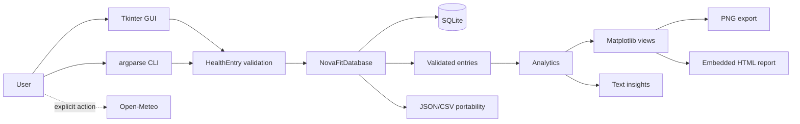

# NovaFit Architecture 🧠⚙️

## Architectural goal

NovaFit is a local-first desktop and CLI application. The design keeps records on the device, separates interfaces from domain rules, and remains explainable by a junior developer in a technical interview.

## System map



## Layer responsibilities

### Domain model

`models.py` owns the normalized record contract. `HealthEntry` is immutable and validation-driven.

### Validation

`validation.py` converts user/import values into bounded domain values. Interfaces do not duplicate validation logic.

### Persistence

`database.py` owns SQLite:

- schema creation;
- compatible migration;
- CRUD;
- parameterized queries;
- connection lifecycle;
- row mapping.

### Portability

`io_utils.py` owns:

- JSON export/import;
- CSV export/import;
- import strategies;
- sample data;
- Faker data;
- backup helpers.

### Analytics

`analytics.py` contains pure functions over entries/settings:

- summaries;
- streaks;
- rolling series;
- weekday profiles;
- mood distributions;
- calendar matrices;
- grounded text insights.

### Visualization

`charts.py` builds independent Matplotlib `Figure` objects. It does not know about Tkinter widgets or SQLite connections.

### Reporting

`reporting.py` embeds a chart and escaped data in one offline HTML document.

### Interface adapters

`cli.py` and `gui.py` orchestrate services. They should remain thin enough that domain behavior can be tested without opening a window.

### Dashboard integration

`dashboard_panel.py` is a reusable ttk adapter for:

- chart controls;
- metric cards;
- insight text;
- goal progress;
- Matplotlib canvas/toolbar.

### Optional weather

`weather.py` contains the only runtime network boundary. The API receives coordinates only after explicit user action.

## Dependency rules

Allowed:

```text
GUI -> models / database / analytics / reporting
CLI -> models / database / analytics / reporting
reporting -> analytics / charts
charts -> analytics / models / settings
analytics -> models / settings
database -> models / settings
```

Avoid:

```text
database -> GUI
analytics -> SQLite
models -> Tkinter
weather -> health records
charts -> database path
```

## Startup sequence

### GUI

1. resolve configured paths;
2. open/initialize SQLite;
3. load safe settings;
4. construct UI styles and workspaces;
5. query records;
6. calculate metrics;
7. embed selected chart.

### CLI

1. parse arguments;
2. configure logging;
3. create database adapter;
4. dispatch exactly one action;
5. report success/error with a short message.

## Settings lifecycle

`AppSettings` validates:

- goals;
- city;
- theme;
- chart range;
- chart view;
- reduced motion.

Invalid/corrupt settings fall back to defaults with a warning.

## Data migration

The runtime schema upgrade is additive. An explicit script offers backup-first migration for users who prefer a visible copy before launch.

## Error strategy

Programmer errors:

- remain visible during development;
- fail tests/verification.

User errors:

- become actionable CLI messages or dialogs;
- avoid raw tracebacks unless debug mode is enabled.

Recoverable network errors:

- return a structured unavailable report;
- do not block local functionality.

## Testability decisions

- immutable model;
- dependency-free analytics;
- temporary-path database constructor;
- mocked weather fetcher;
- headless Matplotlib backend;
- subprocess smoke workflow with environment path overrides.

## Extension points

Safe current extensions:

- new CLI action using existing services;
- new chart view using entries/settings;
- new export format without modifying SQLite;
- new city alias;
- additional validated optional metric after schema/design review.

High-risk extensions requiring a design document:

- encrypted database;
- user profiles;
- sync/cloud storage;
- local REST server;
- medical interpretation;
- background network requests.
